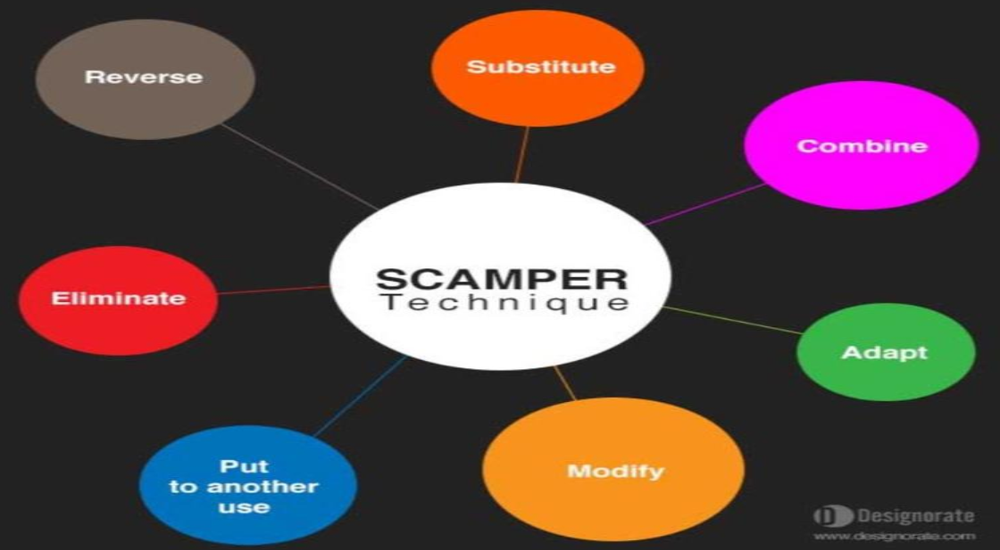
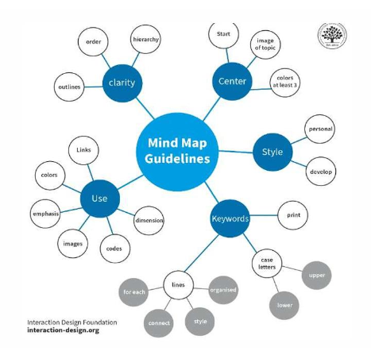
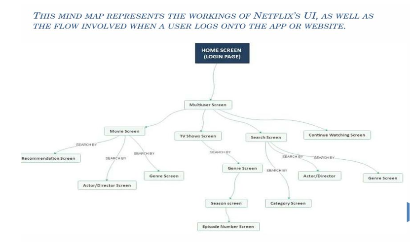

# Ideation And Prototyping

- third phase of design thinking, goal -> generate a large quantity of ideas
- builds on the empathy gained in the previous stages

## Importance

1. Bridge between problem and solutions
2. Encouraging Divergent Thinking
3. Exploring Multiple angles

## Techniques

1. Brainstorming
2. Storyboarding
3. Mind mapping

## Brainstorming

Group activity used to generate a magnitude of ideas

### Key Features

1. Group dynamics
2. No criticism
3. Encouraging wild ideas

### SCAMPER

> [!IMPORTANT]
> don't skip

- goal is to innovate or improve a product / service that already exists

#### How does scamper work?

<!-- markdownlint-disable MD013 -->

| Letter | Meaning                | One-line Explanation                                                 |
| ------ | ---------------------- | -------------------------------------------------------------------- |
| **S**  | **Substitute**         | Replace one thing with another to improve it.                        |
| **C**  | **Combine**            | Join two or more ideas/features together to create something better. |
| **A**  | **Adapt**              | Borrow or adjust an idea from somewhere else to fit your problem.    |
| **M**  | **Modify**             | Change the size, shape, appearance, or feature to improve it.        |
| **P**  | **Put to another use** | Use the product in a different way or for a different purpose.       |
| **E**  | **Eliminate**          | Remove unnecessary parts to make it simpler and better.              |
| **R**  | **Reverse**            | Do the opposite or change the order of how something works.          |

<!-- markdownlint-enable MD013 -->

## Storyboarding

- practice of create a sequence of visuals
- represents how a user will interact with a product
- translates user research into a **simple narrative**

### Types

1. Digital
2. Traditional
3. Video
4. Written
5. Sketched
6. 3D

### How to create a story board

Mapping user journey through your app
example:

1. starting point
2. select a feature
3. select a product
4. payment
5. receive confirmation

## Mind Mapping

> [!IMPORTANT]
> don't skip

- visual brainstorming technique
- see connections between different ideas

1. Central Idea
2. Branches
3. Sub branches
4. Keywords and symbols
5. Review and expand

### Benefits

1. Visual Organization
2. Encourages Creativity
3. Collaboration

## Evaluation of Ideas

1. Pass fail Evaluation
2. Evaluation Matrix (evaluate on criteria and score)
3. SWOT analysis

## Prototype Phase

- 4th stage of design thinking
- test ideas before investing
- scaled down version

### Why Prototype?

1. Test and Validate ideas
2. Reduce risk
3. Gather feedback
4. Iterate and Improve
5. Enhance Usabilty and Design
6. Engage stakeholders
7. Simulate final project

> test -> reduce -> feedback -> iterate -> use -> stakeholders -> simulate

### Types of Prototyping

> Low → Mid → High

#### Low Fidelity

- low effort and investment
- basic concept no detail

1. Paper Prototyping

#### Mid fidelity

- can be inexpensive
- don't require much design knowledge
- test user flow, broad functions

1. Clickable Wireframe

#### High Fidelity

- more detailed and realistic
- close to final product
- expensive and time consuming

## Lean startup method for prototype development

- Focuses on building prototype quickly
- Learning fast, reducing waste and create solutions

### Steps

> BML

1. Build (Prototype)
2. Measure (Test)
3. Learn (Iterate)

## Visualization

1. Sketches and doodles
2. Wireframe
3. Prototypes
4. Storyboards
5. journey Maps
6. Infographics
7. Digital Model and simulations
