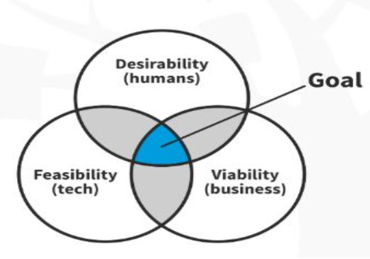
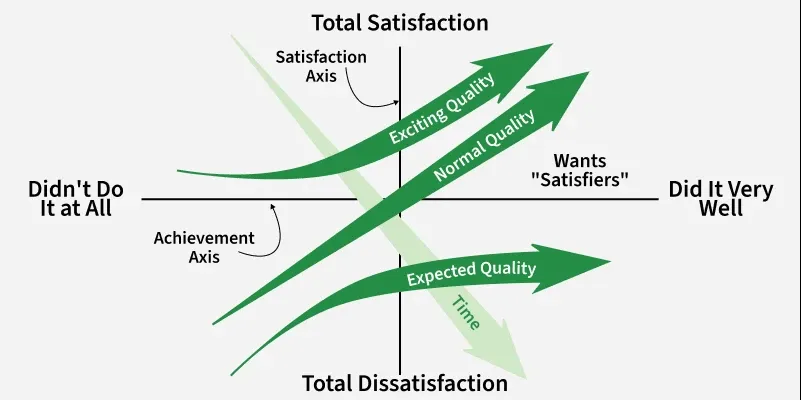
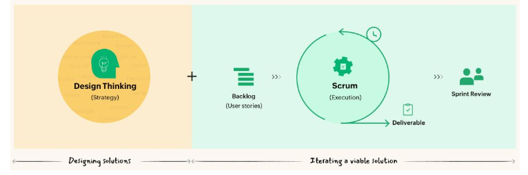
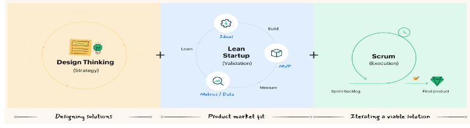
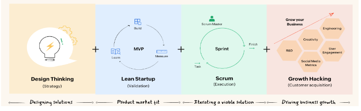

# Testing Implementation

## Test Phase

test the product on full scale, get feedback

### Key activities

1. Conducting Tests
2. Gathering Feedback
3. Analyzing results
4. Improving Prototypes
5. Redefining the problem

> test → feedback → analyze → improve → redefine

### Key Factors of Testing phase

1. Desirabilty
2. Viabilty
3. Feasibilty

## Key Steps to Conducting a Test

1. define your goal
2. recruit the right people
3. set the scene
4. show don't tell
5. encourage thinking out loud
6. observe closely
7. ask follow up questions
8. embrace negative feedback
9. document findings

## Types of Testing

### Usabilty Testing

you watch real people try to do some task

| Strenghts                      | Weakness                 |
| ------------------------------ | ------------------------ |
| shows if design is easy to use | different for everyone   |
| finds proble fast              | hard to put into numbers |
| explains user thinking         | -                        |

### First Click Testing

examines where users click first attempting to complete a task

| Strenghts                   | Weakness             |
| --------------------------- | -------------------- |
| shows if features are clear | misses the "why"     |
| finds hidden problems       | needs extra research |
| works at any stage          | -                    |

### A/B Testing

compares two or more versions of a product/page/feature

| Strenghts            | Weakness         |
| -------------------- | ---------------- |
| uses hard facts      | misses the "why" |
| improves performance | needs many users |
| highly versatile     | limited scope    |

### Desirabilty Testing

understand how users feel about a product

## Kano Model

> [!IMPORTANT]
> don't skip

- customer satisfaction based on different types of features
- evalutaion based on customer satisfaction and investment required

### Working

1. Listing Potential Features
2. Evaluating Customer Satisfaction
   1. must be
   2. performance
   3. delighters
3. Assess Investment
4. Investment vs Satisfaction (find sweet spot)

### Categories of Kano model

1. Basic Needs -> Must have
2. performance Needs -> More is Better
3. Excitement Needs -> Delighters
4. Indifferent Needs -> take it or leave it
5. Reverse needs

## Agility in Design Thinking

> [!IMPORTANT]
> don't skip

- abilty of teams to adapt quickly, iterate continously and respond to user feedback

### Design Thinking + Scrum

- DT to generate ideas, add ideas to scum blacklog, start sprint

### Design thinking + Lean startup + agility

- lean startup focuses on testing ideas with custer and learning from real data

### Design thinking + Lean startup + Agility + Growth hacking

- growth hacking is used to get continuous feedbacks from different channels

## Tips for interviews

1. define goals
2. ask open ended questions
3. avoid leading questions
4. listen actively
5. observe body language
6. Go deeper
7. Use simple language
8. Record responses
9. Thank the participant

## Tips for surveys

1. define goals
2. keeps questions short and simple
3. use clear and unbiased wording
4. prefer closed ended questions
5. limit the number of questions
6. use consistent rating scales
7. avoid double questions (only one thing per question)
8. test the survey first
9. ensure privacy
