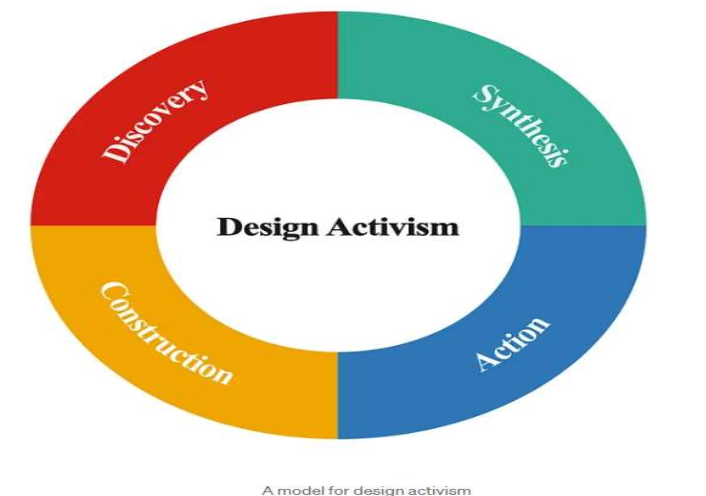

# Unit 6 - Future

## Design Thinking Meets the Corporation

- human centered design thinking -> corporate strategy / operations

### Trends shaping its future

1. AI Powered design thinking
2. Remote collaboration tools
3. Sustainability-driven innovations
4. Data informed empathy - real user data + research + understand user better

> AI → remote → sustain → data informed

### Best Practices

1. Focus on Users
2. Collaborate across teams
3. Create safe spaces
4. Start small and iterate
5. Integrate and align
6. Provide Resource and training
7. Measure and learn

## Social Contract

- shared agreement between a designer and a client
- prevents misunderstanding
- builds positive working relationship
- confirms that both sides want same outcome
- makes everyone accountable
- encourages teamwork and commitment

### How designers use social contracts

- terms and conditions
- deadlines and stuff
- non negotiables

### What is included in social contracts

1. Roles and responsibilities
2. Behavior expectations
3. Priorities
4. Availability
5. Communication methods
6. timeline
7. conflict resolutions

## Design Activism

> [!IMPORTANT]
> don't skip

- goes beyond solving individual user problems
- focuses on broader social / environmental changes

### Regular DT

- man see wheelchair
- man think wheelchair bad, can make wheelchair better

### Design activism

- man see wheelchair
- man see user cannot enter building
- wheelchair not problem -> add ramp

### Model for Design Activism

1. Discovery -> Listening
2. Synthesis -> Thinking
3. Action -> Change
4. Construction -> Building

> D S A Construct

## Key Concepts for Designing tomorrow

1. Visionary Thinking
2. Systemic Impact
3. Emerging technologies
4. Iterative and non linear process

> Vision, impact, new, iterate
