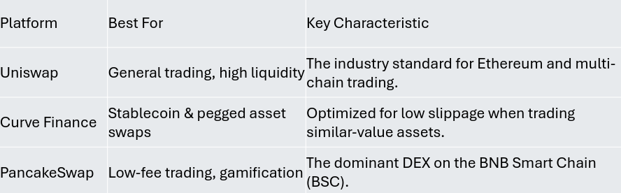

# Question Bank

## Concept of Cryptocoins

- digital currencies
- operate on thier own blockchain
- used primarily as medium of exchange
- cryptographic techniques to secure transactions
- operate without central authority

### Examples

1. Bitcoin
2. ethereum
3. Litecoin

### Advantages (E Commerce)

1. Faster transactions
2. lower transaction cost
3. global accessibilty
4. enhanced security
5. Transparency
6. No Chargebacks
7. 24/7 availabilty
8. Privacy protection
9. international trades

## Token vs Cryptocurrency coins

> [!NOTE]
> BC = Blockchain

| Cryptocurrency Coin               | Token                         |
| --------------------------------- | ----------------------------- |
| own blockchain                    | on top of exisiting BC        |
| independent blockchain network    | uses another BC's infra       |
| used as money, transaction fees   | represent assets, voting      |
| created by mining / consensus     | created using smart contracts |
| bitcoin, ethereum, etc            | USDT, LINK, UNI, etc          |
| transaction fees → paid on own BC | fees paid on host BC          |

## DeFI

- aka decentralized finance
- financial system built on blockchain
- provides financial services without needing traditional intermediaries
- uses smart contracts to automate financial transactions

### Features

1. Decentralization
2. Transparency
3. Permissionless Access
4. Smart Contracts
5. Non Custodial

### Applications of DeFI

1. **Peer to Peer lending and borrowing**
   - no need bank to borrow and lend
   - smart contracts manage collaterals
2. Decentralized Exchanges
   - allows users to trade crypto directly
   - no intermediaries
   - prices determined using liquidity pools
3. Yield Farming and Staking
   - lock their crypto assets to earn rewards / interests
   - passive income
4. Stablecoins
   - cryptocurrencies designed to maintain stable value
   - by being pegged to assets such as US dollars
5. Insurance Services
   - insurance services against smart contract failures
6. Asset Management
   - automatically manage investment portfolios
   - rebalance assets
7. Cross border payments
   - enables faster and cheaper international transactions

### Benefits and Risks associated with DeFI

#### Benefits

1. Lower Transaction costs
2. global accessibilty
3. Transparency
4. User control
5. finacial inclusion
6. innovation
7. Instant settlements

#### Risks

1. scalability issues
2. regulatory challenges
3. privacy concerns
4. security risks
5. technical complexity
6. hidden centralization
7. no consumer protection

### Future Trends of DeFI in different sectors

1. decentralized protfolio management
2. composabilty
3. lending and borrowing innovations
4. Risk management and insurance
5. Payment and transaction sector
6. investment sector
7. banking sector
8. regulatory and compliance sector
9. asset management sector
10. financial inclusion

## Cryptocurrency

- **cryptography + blockchain**
- digital virtual currency
- uses crpytography for security
- operates on blockchain

### Features

1. Decentralized
2. Secure
3. Transparent
4. Global
5. Fast and low cost

### Uses of Cryptocurrency

1. E commerce and online payments
2. Banking and Financial Services
3. Decentralized Finance
4. Investment and Trading
5. Supply chain management
6. Healthcare sector
7. Smart contracts
8. Voting systems
9. Digital Identity management

## Centralized vs Decentralized Finance

| centralized fi               | Decentralized fi                   |
| ---------------------------- | ---------------------------------- |
| controled by banks           | controlled by smart contracts      |
| intermediaries               | no intermediares                   |
| assets held by banks         | assets held by users               |
| indentity verification       | no identity verification           |
| private databases            | public blockchains                 |
| transactions long time       | transactions fast af               |
| settlement → banks           | settlements → blockchains          |
| governance → banks           | governance → protocols             |
| vulnerable to data breaches  | vulnearable to smart contract bugs |
| goverment provide protection | users bear most risks              |

## Cryptocurrency mining

- validating transaction and adding them to blockchain
- use powerful computers to solve problems
- first miner to solve adds new block
- receives crypto as reward

```
Users Make Transactions
          ↓
Transactions Collected into a Block
          ↓
Miners Solve Cryptographic Puzzle
          ↓
Block is Verified
          ↓
Block Added to Blockchain
          ↓
Miner Receives Cryptocurrency Reward
```

### Advantage of Cryptocurrency mining

1. Secures blockchain
2. validates transactions
3. prevents double spending
4. Decentralization
5. Introduces new coins
6. Transparency
7. Network reliabilty
8. Earning opportunites

## Blockchain

- distributed decentralized ledger
- stores transactions in blocks
- blocks lined together using crpytographic hashes
- each block contains transaction data, timestamp and hash of prev
- immutable
- distributed

## Cryptocurrency Wallets

- software / physical device used to store, send, recieve crypto
- dont store actual coins
- stores private and public key

### Types

1. Hot Wallets (Connected to internet)
2. Cold Wallets (Offline storage)

### Advantages of Cryptocurrency Wallets

1. secure storage
2. user control
3. fast transactions
4. global accessibilty
5. privacy
6. supports multiple crypto
7. lower transaction costs
8. 24/7 availabilty

### Disadvantages of Crypto wallets

1. risk of losing private key
2. security threats
3. user responsibilty
4. Irreversible
5. Technical complexity
6. Hardware wallet costs
7. Device failure

## Decentralized Exchange (DEX)

- no central authority
- replace the central authority with smart contract
- pices of code that allow 2 people to enter into an agreement
- allow you to swap crypto with crypto
- the crypto needs to be in the same blockchain

### Fund Management in DEX

1. user store crypto in wallet
2. wallet connected to DEX
3. User approves the smart contract to access some amount of tokens
4. smart contract executes trade
5. the traded assets transfered back to user's wallet

> [!NOTE]
> "Funding" a dex means:
>
> 1. adding funds to your wallet
> 2. providing liquidity to liquidity pools

### Trading Logic of DEX

1. user connects wallet to dex
2. user selects token to swap
3. dex checks the liquidity pool containing token
4. AMM (Automated Market Markers) calculates the exchange rate
5. user confirms the transaction and pays gas fee
6. smart contract executes swap

### Benfits of DEX

- no KYC
- no central authority
- faster than centralized exchanges
- small fee
- open source

### Downsides

- No Support
- use hot storage device (wallets connected to internet)
- low liquidity - if u sell ton of tokens u can crash the price
- code is open source

### Concerns related to DEX

1. Security Concerns
   - smart contract vulnerabilities
   - phishing attacks
   - private key theft
2. Control Concerns
   - gonvernance centralization
   - malicious proposals
   - slow decision making
3. Privacy concerns
   - public transactions
   - wallet tracking
   - regulatory pressure
   - piracy missuse

| Aspect       | Concern                                          | Example                         |
| ------------ | ------------------------------------------------ | ------------------------------- |
| **Security** | Smart contract bugs, hacks, private key theft    | Uniswap audit and bug bounty    |
| **Control**  | Governance centralization by large token holders | Curve Finance governance voting |
| **Privacy**  | Public transaction records and wallet tracking   | Tornado Cash using ZKPs         |

### Top DEXs for Trading

1. Uniswap
   - most popular
   - uses autmated market maker
   - supports large number of tokens and multiple blockchains
2. Curve Finance
   - stable coin
   - low slippage transaction
3. PancakeSwap
   - BNB Smart chain
   - low transaction costs and fast confirmations



## India's Approach towards Cryptocurrency Regulation

- cautious and balanced approach
- allows use of crypto while imposing taxes

### Reasons behind this approach

1. Money Laundering concerns
2. Terrorism Financing Risks
3. Tax Evasion
4. Consumer Protection
5. Financial Stabilty
6. Capital Flight Concerns
7. Enchoraging blockchain innovation
8. Legal and Regulatory Clarity
9. RBI and Supreme court

## Liquidity of DEX

- availabilty of assets for trading in DEX
- achived through liquidity pools and liquidity providers
- higher liquidity → lower slippage / better trade execution
- uses automated market makers
- providers earn a share of trading frees
- challenges include impermanent loss and liquididty fragmentation

## Volatility of Dex

- degree of price fluctuations
- depends on market demands
- high volatility → rapid price increase or decrease
- increases the risk of loss / gain
- influenced by market participants, large buy/sell orders
- can create uncertainty
- reduced stability
- measured by the extent of price changes over time

## Usabilty of DEX

- ease of use and convenience of DEX
- blockchain literacy gap
- depends on user interface, wallet integration
- lowers the learning curve
- requires users to understand gas fees, private keys, slippage
- users manage their own wallets and keys without customer support
- challenges include complexity, Irreversible transactions

## Future Need for regulation in Crypto

1. Clear Legal Definitions
2. Consumer and Investor Protection
3. Global Coorporation
4. Smart contract Regulation
5. DeFI Regulation
6. Cybersecurity Standards
7. Anti Money laundering
8. Data privacy / legal compliance

## Decentralized Web

- web 3
- web 1 → read only
- web 2 → interaction (data collection + ads)
- utilizing blockchain tech and tools of decentralization
- web 3 → u will be the owner of the content
- digital identity not connected to internet identity

### How it works

1. users interact with dApps
2. dApps communicate with smart contacts
3. data stored across distributed nodes
4. users authenticate using digital wallets
5. transactions / interactions are verified by blockchain

### Benefits of Web 3

1. User ownership of data
2. Improved security
3. Greater privacy
4. No Censorship
5. Transparency
6. Reduced dependence on intermediaries
7. Better reliabilty and availabilty
8. Open innovations

### Applications

- DeFi
- DEX
- NFT
- decentralized social media

## Virtual Currency / Blockchain / Cryptocurrency Regulations

1. KYC
2. Anti money laundering
3. Taxation
4. Exchange Licensing
5. Consumer Protection
6. Stablecoins oversight
7. Cyber security standards

### Importance of virtual currency regulations

- prevents illegal acts
- protects consumers / investors
- ensures tax complience
- financial stability
- resonsible innovation

### Negative effects of regulations

- higher compliance const
- reduced privacy
- increased tax
- market volatility
- slower innovation

## Cross border payments

- money is transfered between individuals located in different contries
- traditional → expensive, intermediaries, slow, complex
- blockchain → simple, fast, decentralized, cheap

```
Sender → Blockchain Network → Receiver
```

### Working

1. sender initiates payment using crypto
2. transaction verified in blockchain network
3. transaction recorded in ledger
4. receiver obtains funds

## Historical Stance of Government regarding blockchain

| Period                              | Government Stance                                                                  |
| ----------------------------------- | ---------------------------------------------------------------------------------- |
| **2009–2013 (Early Phase)**         | Cryptocurrency viewed as experimental; minimal regulation.                         |
| **2014–2017 (Growth Phase)**        | Increased monitoring due to rising adoption and risks.                             |
| **2018–Present (Regulation Phase)** | Introduction of regulations, taxation, KYC/AML compliance, and exchange licensing. |

## Global perspectives of regulations on blockchain

### US

- regulated by agencies (SEC)
- focuses on investor protection, preventing fraud, ensuring compliance

### European Union (EU)

- introduced Market in Crypto-Assets regulatory framework
- provides clear rules for crypto assets, exchanges, etc
- aims to improve Transparency, consumer protection

### China

- BAN
- discourages private crypto
- promotes own central bank digital currency

### Japan

- licensing system for crypto exchange
- supports blockchain innovation while ensuring consumer protection

### Singapore

- considered blockchain friendly
- encourages blockchain innovation while ensuring compliance

### India

- crypto is taxed but not banned
- requires taxation and compliance measures
- supports blockchain while remaining cautious

## Blockchain and Banking sector

### Benefits of BC in Banking

1. faster transactions
2. lowser transaction cost
3. improved security
4. transperency
5. accuracy
6. cross border payment
7. Fraud Prevention (immutable BC)
8. autmoation through smart contracts

### Challenges for BC in Banking sector

1. regulatory uncertainty
2. integration with exisiting banking system
3. high initial implemntation cost
4. scalability and privacy concerns
