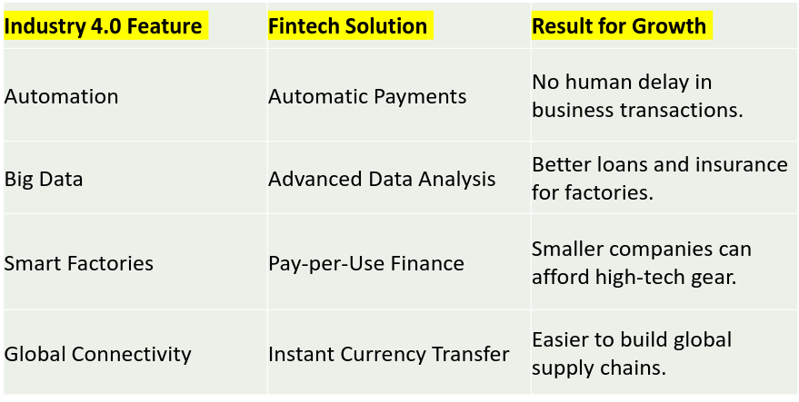

# Obstacles and Framework Conditions

## Obstacles of Industry 4.0

1. **lack of digital strategy and resource scarcity**
2. **lack of standards and poor data security**
3. **financing conditions**
4. **shortage of skilled workers**
5. **lack of broadband infra**
6. **insufficient state support**
7. **Legal and regulatory issues**
8. **Protection of corporate data**
9. **Liabilty issues** → difficult to determine responsibilty
10. **handling personal data**

## Financial Conditions

### FinTech

- Financial Technology
- innovative companies using digital tech to make financial services efficient
- challenges traditional banking

### Categories of FinTech

1. **B2C → Business to Consumer**
   - financial services for general public
1. **B2B → Business to Business**
   - companies and businesses
1. **B2B2C → Business to Business to Consumer**
   - Platforms connecting investors with borrowers
1. **INsurTech → Insurance + Tech**
   - uses IoT and digital tech in insurance
   - vehicle sensors monitoring driving habbits
1. **RegTech → regulatory Tech**
   - helps financial institutes comply with laws

## Legal Frameworks

### Legal Informatics

- use of information and communication tech (ICT) in legal field
- automates legal drafting
- legal reasoning models
- judicial process management
- Applications Include:
  - legislative processes
  - data security models
  - cognitive science
- Three branches
  1. **Software tools**
  2. **Documentary LI**
  3. **Decisional LI**

### Combining Legal Informatics and Industry 4.0

1. real time tracking and transparency
2. data security and risk control
3. predictive insights
4. cost and infrastructure efficiency
5. evolution of profession
   - legal professionals now work with data scientists, CS, engineers

## Availabilty of skilled workers

- one of the major obstacles
- smart factories → smart employees

### Skill Gap

- difference between the skills required by industries and skills possessed
- types
  1. skill missmatch
  2. skill shortage
  3. skill obsolecense → outdated skills

### Causes of Skill gap

1. Digital Transformation
2. Education and training gap
3. Time space gap
4. Demographic changes → exp workers resign after they get skill issued
5. Management gaps

### Consequences of Skill Gap

1. **Business Consequences**
2. **Labour Market Consequences**
